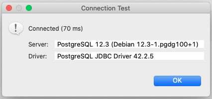

Thanks https://shields.io !

# [NE] Strapi

The project [Strapi NE](https://github.com/itanlam/ne/projects/1)

## To Install

First things first. Creating a docker-composer.yml to Postgres and Makefile for easy usage.

### Postgres YML

[Strapi Dockerfile](db/docker-compose.yml)

```yml
#...
ports:
  - '5432:5432'
expose:
  - '5432'
environment:
  POSTGRES_USER: strapi
  POSTGRES_PASSWORD: strapi
  POSTGRES_DB: strapi
#...
```

**Testing from DBeaver**

```Java
String url = "jdbc:postgresql://localhost/strapi";
Properties props = new Properties();
props.setProperty("user","strapi");
props.setProperty("password","strapi");
props.setProperty("ssl","true");
Connection conn = DriverManager.getConnection(url, props);

String url = "jdbc:postgresql://localhost/strapi?user=strapi&password=strapi&ssl=true";
Connection conn = DriverManager.getConnection(url);
```



### Postgres Makefile commands

**Starting Postgres**

```shell
$> make db-start
```

**Stoping Postgres**

```shell
$> make db-start
```
